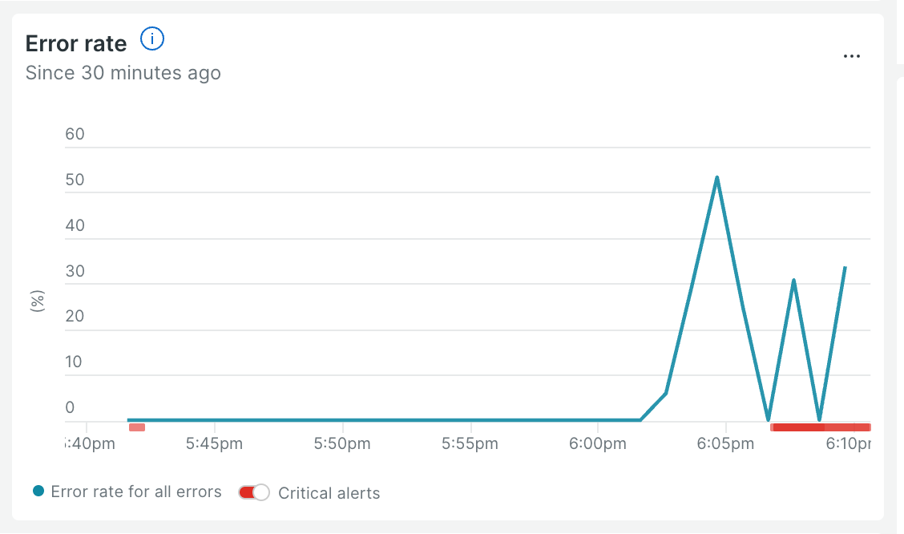

# 🏆 Golden Path: Payment Service Failure

## What Was Happening

The `paymentFailure` feature flag was enabled, causing the **Payment service** to randomly fail a percentage of charge requests. Unlike a total outage, this was an **intermittent failure** — some transactions succeeded while others failed, making it harder to diagnose because the system appeared to be "working" some of the time.

*payment* error rate fluctuated between 20%-30% with spikes as high as 55%.

---

## The Ideal Debugging Path

### 1. Start at the Alert (1 minute)

An alert fires for a high error rate. Rather than jumping straight into a service, start by reading the alert details — it tells you **what condition triggered**, **which entity** is affected, and **when it started**.

This gives you an immediate anchor: you know the scope (error rate, not latency or throughput) and the approximate start time. Every subsequent step should add context to what the alert already told you.

---

### 2. Open the Workload: See the Blast Radius (1 minute)

From the alert, navigate to your team's **Workload**. You'd see multiple services in a degraded state — including `checkout` and `paymentservice`.

`checkout` is the entry point for the payment flow, so it's expected to show errors when anything downstream fails. The question is: **which service is the actual source?**

**Why Workloads matter here:** They give you a single-pane-of-glass view of all affected entities. Rather than checking services one by one, you immediately see the blast radius and can start narrowing toward the root cause.

---

### 3. APM: Find the Root Cause Service (2 minutes)

From the Workload, click into **APM & Services** and look at the error rate column.

You'd see:
- `checkout` showing elevated errors — but checkout is the *caller*, not the source
- `payment` also showing elevated errors — and it's the furthest downstream service in the payment chain

**Why furthest downstream matters:** In a chain of service calls, errors propagate upstream. The service closest to the root cause is the one furthest downstream that is *also* showing errors. `payment` receives calls from `checkout` — if `payment` is failing internally, `checkout` will fail too. Start your deep investigation at `payment`.

---

### 4. APM: Quantify the Error Rate (1 minute)

In **APM → paymentservice → Summary**, observe the error rate.

You'd see:
- An error rate in the 20–30% range — neither 0% nor 100%
- Throughput looks normal — the service is receiving and processing requests

**Key insight:** A non-zero, sub-100% error rate means an intermittent fault, not a total outage. The service is reachable and handling most requests — only a fraction fail. This rules out connectivity issues (like Incident 2) and points toward something inside the service logic.

---

### 5. APM Errors Inbox: Identify the Failing Transaction (1 minute)

Click into the **Errors** tab within `payment` APM.

You'd find:
- A single error group tied to the `grpc.oteldemo.PaymentService/Charge` transaction
- The error message indicates payment failures originating inside the service itself
- The occurrence pattern is steady over time — not a single burst, but a consistent rate

**Why this confirms the root cause:** The error is on `payment`'s own transaction, not a connection error from an upstream caller. The service is reachable and processing requests, but intermittently failing its own charge logic. Combined with the ~25% error rate from Step 4, you have a clear picture: a systematic internal fault affecting a fraction of all charges.

---

## Summary: The 5-Minute Debug

| Step | Tool | Finding |
|------|------|---------|
| Read the alert | Alert details | High error rate on payment flow, start time established |
| See blast radius | Workload | `checkout` and `paymentservice` both degraded |
| Find root service | APM error rates | `paymentservice` is furthest downstream with errors |
| Characterize rate | APM Summary | ~20–50% error rate — intermittent, not total outage |
| Identify transaction | APM Errors | `grpc.oteldemo.PaymentService/Charge` failing internally, steady pattern |

**Total time to root cause: ~5 minutes**

---

## Key Takeaways

- **Start at the alert.** The alert tells you what triggered, which entity is affected, and when. It's the fastest way to orient yourself — don't skip it.
- **Use the Workload for blast radius.** Before diving into any one service, see which entities are degraded. This prevents tunnel vision on the wrong service.
- **Follow errors downstream.** When multiple services show errors, the root cause is usually the furthest downstream service — errors propagate upstream through the call chain.
- **Error location matters.** An error on `payment`'s own transaction means the service is reachable but failing internally. This is different from a connection error on the *caller's* side, which would mean the service was unreachable (as seen in Incident 2).

## ⛔ Wait Before Continuing

**Wait** for your Game Manager's instructions before hitting _"Next"_ below.

Remember: **you want to have all info you can before triggering an incident**, otherwise you may miss key details.

<!--
BETA NOTES — Incident 4 Golden Path

- Verify asset renders: random-payment-failure-chart.png
- The "~20–50%" error rate here should align to whatever value the check script accepts
- Confirm the exact transaction name in APM Errors tab matches "ChargeRequest" or update accordingly
-->
